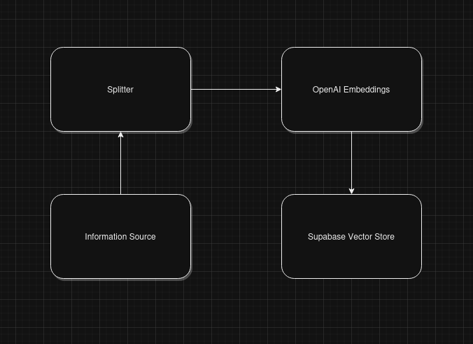
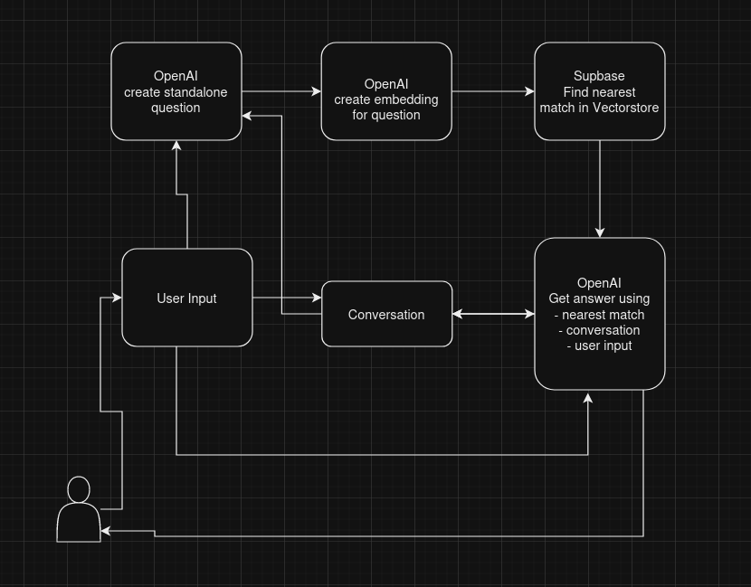

# AI Assistant

- AI Assistant is a chatbot that can provide assistance about the given topic. It is a memory cognizant chatbot that can remember the previous conversation and can provide assistance based on the same history. It uses OpenAI's GPT-3 API to generate the response. It is a web application that can be used on any device with a web browser. It is a single page application that uses webpack to bundle the code. It uses HTML, CSS and JavaScript. It uses langchain to split the text into chunks and then embeds the chunks into Supabase vector database which serves as the information source for the chatbot. Lateron, it uses the same database to retrieve the information and generate the response.

## Built With

- webpack, html, js & css

## Flow Chart

### Information Flow

### Conversation Flow

## Getting Started

To get a local copy up and running follow these simple example steps.

## Pre-requisites

- node.js
- npm

### Setup

- Clone the repository from [GitHub](https://github.com/OmarMWarraich/ai-assistant.git).
- Change to the directory of the repository.

### Install

- Install the dependencies using `npm install`.
- Create a supabase database.
- Run the script in './src/match_documents.sql' in SQL editor of the supabase database.
- Split the information source into chunks and upload to the supabase database.
- Create a .env file in the root directory of the project.
- Add the following environment variables in the .env file.
  - `SUPABASE_URL` - The url of the supabase database.
  - `SUPABASE_KEY` - The key of the supabase database.
  - `OPENAI_KEY` - The key of the OpenAI API.
- Run `npm run build` to build the project.
- Run on live server.

## Authors

👤 **Author1**

- GitHub: [@OmarMWarraich](https://github.com/OmarMWarraich)
- Twitter: [@omarwarraich1](https://twitter.com/@omarwarraich1)
- LinkedIn: [Omar Mohammad](https://www.linkedin.com/in/omar-mohammad-a9902847/)

## 🤝 Contributing

Contributions, issues, and feature requests are welcome!

Feel free to check the [issues page](../../issues/).

## Show your support

Give a ⭐️ if you like this project!

## Acknowledgments

- Anybody whose code was used

## 📝 License

This project is [MIT](./MIT.md) licensed.
